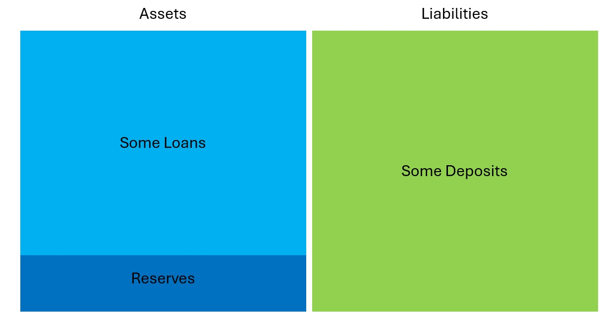
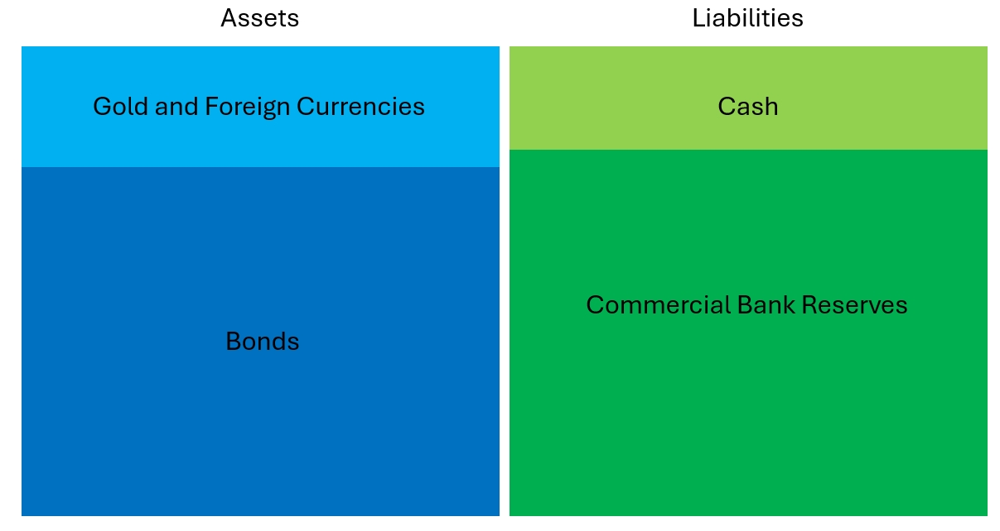
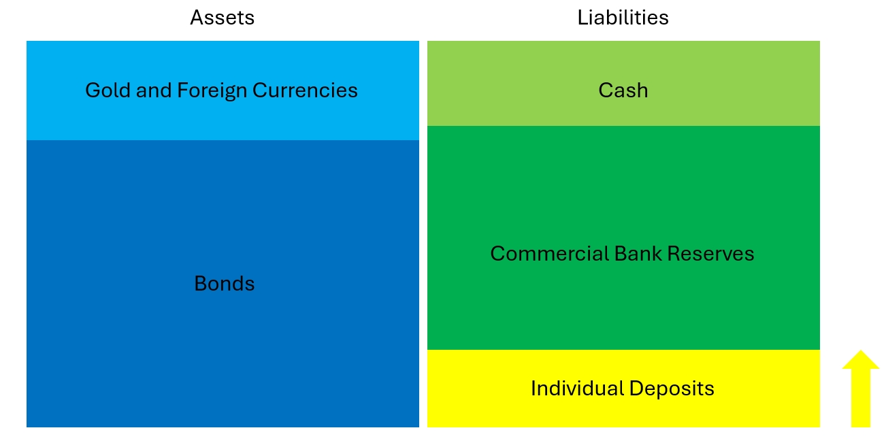

In the aftermath of the failures in the 2007-2008 Global Financial Crisis (GFC), there were attempts to overhaul the financial system. Hence, we got Basel III, which imposes capital requirements for systematically important institutions no higher than that reported by Lehman the day before it failed (see [Boone and Johnson, 2011](https://www.piie.com/commentary/op-eds/future-banking-more-regulation-needed)), amazing.

It is therefore not surprising that we saw bank runs again in 2023 which contributed to the collapse of the Silicon Valey Bank (SVB), Silvergarte Bank and Signature Bank. Absurdly enough, the Fed's response to these failures was to create the Bank Term Funding Program (BTFP) which allowed the surviving banks to borrow cheaply, and deposit the borrowed funds with the Fed at a higher interest rate for a profit (see Lee and Wessel's [post](https://www.brookings.edu/articles/what-did-the-fed-do-after-silicon-valley-bank-and-signature-bank-failed/)).

Could we have done better than that? I have a plan - let people save the money with the central bank, for real.

Urghhh, that's not what central banks are meant to do! Urghhhh, this has severe political and financial repercussions! Urghhhhh, you are destroying the current banking sytem! Heyy heyy, don't be pre-occupied with the mainstream economic dogma which has made macro-economics so pathetic today. I'm a political science student myself and I know that this plan is politically controversial and the duty of taking deposits from the public is not on the current central banks' mandates. But let's think of the future, shall we? It's better for me to have a quixotic plan rather than for the policy-makers to have no alternatives when they are looking for a solution after the next crisis. After all, when you delve in the details my plan, it is not as radical as you may think.

Here's a summary:
- Central banks should allow the public to make *demand* deposits with them and receive interests *daily* at the policy deposit rate.
- To compensate for the commercial banks' lost deposits, the commercail banks may borrow from the central bank *without collateral* at the policy lending rate, and lend to borrowers at a higher rate.
- Central banks cannot be "run" by depositors as it can only exchange one form of its liability (deposit) to another (cash or commercial bank reserves)
- As long as the central banks do not withdraw their "savings" from the commercial banks - they can't by design, by the way; the commercial banks would be immune from bank runs.
- Central banks under this setting can be intuitively understood as a firewall between the (demand) depositors and commercial banks.

Let me walk you through this process with some graphical illustrations of balance sheets：

We start with a commercial bank, let's say, Pony (no allusion to Lloyds), which initially has a balance sheet that looks something like this:

The central bank's balance sheet would look like this:

If some depositors start moving their demand deposits to the central bank, this will not change the *size* but the *composition* of the balance sheet of the central bank. Namely, some central bank reserves become individual deposits at the central bank:

# Frequently Asked Questions
